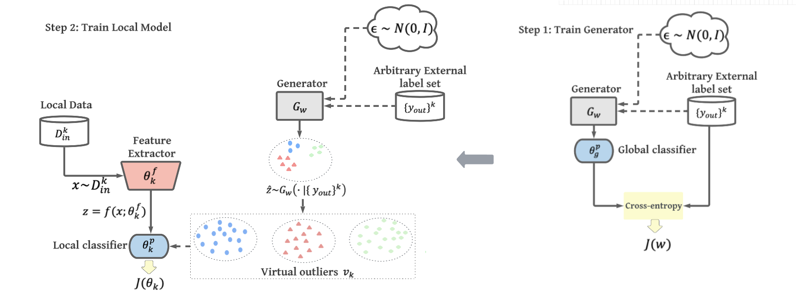

# FOSTER
Code for paper [***Turning the Curse of Heterogeneity in Federated Learning into a Blessing for Out-of-Distribution Detection***](https://openreview.net/pdf?id=mMNimwRb7Gr) by Shuyang Yu, Junyuan Hong, Haotao Wang, Zhangyang Wang and Jiayu Zhou.

## Overview

Deep neural networks have witnessed huge successes in many challenging prediction tasks and yet they often suffer from out-of-distribution (OoD) samples,
misclassifying them with high confidence. Recent advances show promising OoD detection performance for centralized training, and however, OoD detection in
federated learning (FL) is largely overlooked, even though many security sensitive applications such as autonomous driving and voice recognition authorization are commonly trained using FL for data privacy concerns. The main challenge that prevents previous state-of-the-art OoD detection methods from being incorporated to FL is that they require large amount of real OoD samples. However, in real-world scenarios, such large-scale OoD training data can be costly or even infeasible to obtain, especially for resource-limited local devices. On the other hand, a notorious challenge in FL is data heterogeneity where each client collects non-identically and independently distributed (non-iid) data. We propose to take advantage of such heterogeneity and turn the curse into a blessing that facilitates OoD detection in FL. The key is that for each client, non-iid data from other clients (unseen external classes) can serve as an alternative to real OoD samples. Specifically, we propose a novel Federated Out-of-Distribution Synthesizer (FOSTER), which learns a class-conditional generator to synthesize virtual external-class OoD samples, and maintains data confidentiality and communication efficiency required by FL. Experimental results show that our method outperforms the state-of-the-art for OoD tasks by 2.49%, 2.88%, 1.42% AUROC, and 0.01%, 0.89%, 1.74% ID accuracy, on CIFAR-10, CIFAR-100, and STL10, respectively. 

## OoD dataset used for evaluation
Links for less common datasets are as follows, [80 Million Tiny Images](http://horatio.cs.nyu.edu/mit/tiny/data/tiny_images.bin)
[Textures](https://www.robots.ox.ac.uk/~vgg/data/dtd/), [Places365](http://places2.csail.mit.edu/download.html), [LSUN-C](https://www.dropbox.com/s/fhtsw1m3qxlwj6h/LSUN.tar.gz), [LSUN-Resize](https://www.dropbox.com/s/moqh2wh8696c3yl/LSUN_resize.tar.gz), [iSUN](https://www.dropbox.com/s/ssz7qxfqae0cca5/iSUN.tar.gz).
Please download these dataset to folder ``\dataset``.

## Training & Testing
Example for running foster:
```
#Train
python foster.py --pd_nuser 50 --pu_nclass 3 --wk_iters 5 --model wrn --data stl --con_test_cls --no_track_stat --iter 300 --local_fc --use_external gen_inverse --method crossentropy --score OE --select_generator 1
#Test
python foster.py --pd_nuser 50 --pu_nclass 3 --wk_iters 5 --model wrn --data stl --con_test_cls --no_track_stat --iter 300 --local_fc --use_external gen_inverse --method crossentropy --score OE --select_generator 1 --test --evaluation_score msp
```
Example for running VOS in FL:
```
#Train
python foster.py --pd_nuser 50 --pu_nclass 3 --wk_iters 5 --model wrn --data stl --con_test_cls --no_track_stat --iter 300 --local_fc --use_external None --method crossentropy --score OE --select_generator 1
#Test
python foster.py --pd_nuser 50 --pu_nclass 3 --wk_iters 5 --model wrn --data stl --con_test_cls --no_track_stat --iter 300 --local_fc --use_external None --method crossentropy --score OE --select_generator 1 --test --evaluation_score msp
```
Example for running fedavg:
```
#Train
python foster.py --pd_nuser 50 --pu_nclass 3 --wk_iters 5 --model wrn --data stl --con_test_cls --no_track_stat --iter 300 --local_fc --use_external None --method crossentropy --score OE --select_generator 1 --loss_weight 0
#Test
python foster.py --pd_nuser 50 --pu_nclass 3 --wk_iters 5 --model wrn --data stl --con_test_cls --no_track_stat --iter 300 --local_fc --use_external None --method crossentropy --score OE --select_generator 1 --loss_weight 0 --test --evaluation_score msp
```

Definition for some important parameters:
|Parameter name | Deifinition|
| ------------- |------------|
|pd_nuser|users per domain(for cifar10, cifar100, stl, they only have 1 domain. DomianNet has multiple domains.)|
|pr_nuser|active users per comm round|
|pu_nclass|class per user|
|evaluation_score|post hoc score, eg, msp, Odin, energy, SVM|
